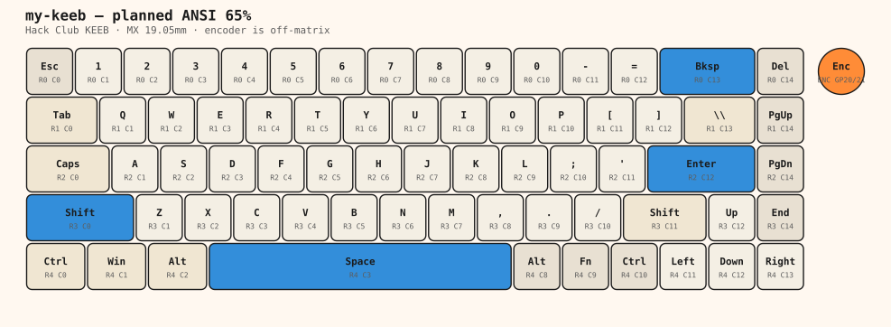

# my-keeb

A first custom mechanical keyboard for [Hack Club KEEB](https://keeb.hackclub.com/).

**Builder:** Kiaan Mittal
**Layout:** ANSI 65% (68 keys) + EC11 encoder + 0.91" OLED
**Controller:** [Orpheus Pico](https://orpheuspico.hackclub.com/) (RP2040, Pico-compatible)
**Status:** Planning / repo setup — schematic and PCB come next

## What I'm building

A tray-mount 65% that I design, order, solder, and flash myself. The KEEB docs suggest 60% or 65% for a first board, and I want arrow keys plus a nav cluster so this can be a daily driver, not just a project that sits on a shelf.

The extras that make it mine:

- **EC11 rotary encoder** in the top-right corner for volume (and scroll on a layer)
- **0.91" I2C OLED** near the USB port for layer / WPM
- **Hack Club / Orpheus silkscreen** on the back of the PCB
- **3D-printed tray-mount case**, split so it fits a ~220mm printer bed

## Why

I want to learn the whole stack: schematic → PCB → case → firmware → soldering. KEEB funds the parts through a grant if the repo documents the build honestly. This repo is that documentation.

## Repo layout

This follows the [KEEB GitHub repo guide](https://keeb.hackclub.com/docs/github-repo/) and [submission checklist](https://keeb.hackclub.com/docs/submitting).

| Path | What belongs here |
| --- | --- |
| [`README.md`](README.md) | Project writeup (this file) |
| [`JOURNAL.md`](JOURNAL.md) | Hour log and journal index |
| [`journal/`](journal/) | Dated entries + photos every 1–4 hours |
| [`bom.csv`](bom.csv) | Bill of materials for the grant |
| [`PLAN.md`](PLAN.md) | Design decisions, matrix, and case notes |
| [`layout/`](layout/) | KLE JSON, SVG sketch, matrix map |
| [`pcb/`](pcb/) | KiCad project, later Gerbers + drill files |
| [`case/`](case/) | Onshape STEP exports for case and plate |
| [`firmware/`](firmware/) | [RMK](https://rmk.rs/) config for the Pico |
| [`photos/`](photos/) | Progress shots and the finished board |

## Current plan

- **Switches:** MX-style tactile (grant-friendly AliExpress set)
- **Keycaps:** white blank DSA (same height on every row, so a weird layout still works)
- **Stabilizers:** PCB-mount MX for Backspace (2u), Enter (2.25u), Left Shift (2.25u), Space (6.25u)
- **Diodes:** through-hole 1N4148, one per switch, to prevent ghosting
- **Matrix:** 5 rows × 15 columns on GP0–GP19
- **Firmware:** RMK on RP2040, with a Fn layer for missing keys (F-row, media, Delete if I remap later)

Full pinout, key coordinates, and case constraints are in [`PLAN.md`](PLAN.md).

## Hours

Hours are logged in [`JOURNAL.md`](JOURNAL.md). Every entry has a time spent, a short writeup, and photos when there is something to photograph. That is how KEEB verifies the build.

Optional time tracker: [Lapse](https://lapse.hackclub.com/).

## What I've learned so far

- A 65% has more keys than a Pico has GPIO, so the board has to be a **row/column matrix** with a diode on every switch.
- MX pitch is **19.05mm**. A 16u-wide 65% is about **305mm**, which is too wide for most 3D printers — the case has to split.
- Only keys **2u and wider** need stabilizers.
- The Pico USB-C port should hang off the PCB edge so a cable can actually plug in.
- Grant parts stay cheap if I stick to the [KEEB grants list](https://keeb.hackclub.com/docs/grants): Orpheus Pico, MX switches, DSA blanks, 1N4148s, EC11, 0.91" OLED, M3 hardware.

## Next

1. Install KiCad and [marbastlib](https://github.com/ebastler/marbastlib)
2. Draw the schematic from the matrix map in `layout/matrix.md`
3. Place switches on a 19.05mm grid and route the PCB
4. Export Gerbers, then model the case in Onshape
5. Apply for the grant with an updated `bom.csv`
6. Solder, flash RMK, keep journaling

## Links

- [KEEB docs](https://keeb.hackclub.com/docs)
- [Making your GitHub repo](https://keeb.hackclub.com/docs/github-repo/)
- [Grants](https://keeb.hackclub.com/docs/grants)
- [Submission form](https://forms.hackclub.com/t/iKhxEp4gL9us) (when the build is done)
